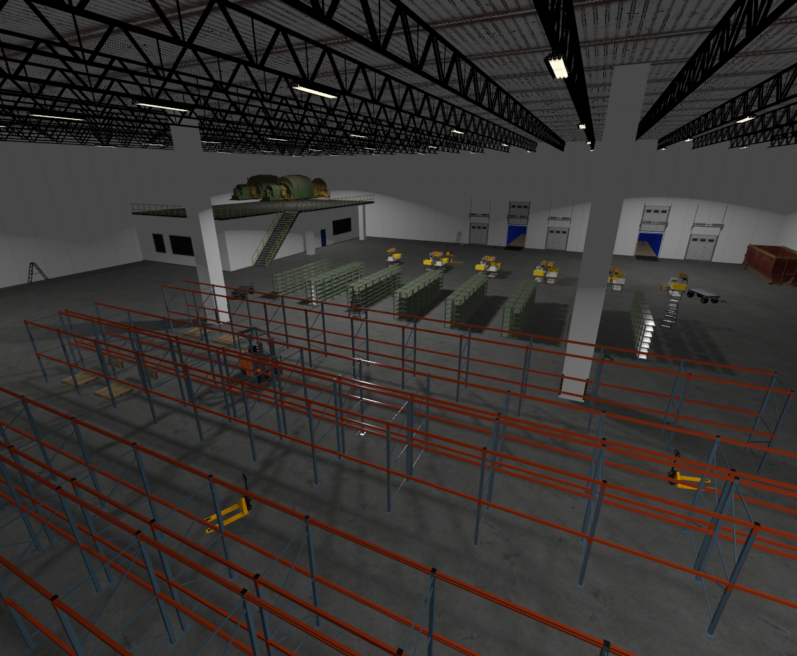

# jetty_demo
Jetty demo world and resources



Usage:

```
git clone https://github.com/gazebosim/jetty_demo
cd Jetty_Warehouse
gz sim -v 4 jetty.sdf
```


## Performance notes

It can take up to 1~2 minutes to load the world with all the models.
The GUI will be non-responsive during this time.

To speed up loading the demo world, you can comment out different models
in the world, which helps improve startup time and RTF.

For example, some `Picking_Shelves*` were already commented out in
the world sdf file. To further speed things up, you can comment out
all of them.

