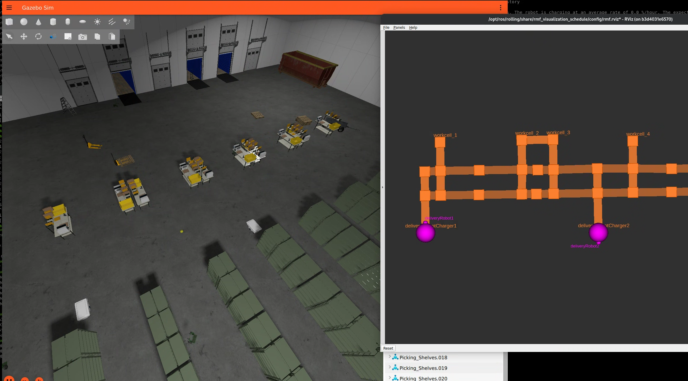

# jetty_demo
Jetty demo world and resources


Quick Start:

```bash
git clone https://github.com/gazebosim/jetty_demo
cd jetty_demo
export GZ_SIM_RESOURCE_PATH=`pwd`/jetty_demo/models:$GZ_SIM_RESOURCE_PATH
gz sim -v 4 jetty_demo/worlds/jetty.sdf
```

Or launch it from [rocker](https://github.com/osrf/rocker?tab=readme-ov-file#installation),

```bash
rocker --x11 -- ghcr.io/gazebosim/jetty_demo:main ros2 launch jetty_demo world.launch.xml
```

### Launching the Open-RMF demo



```bash
rocker --x11 -- ghcr.io/gazebosim/jetty_demo:main ros2 launch jetty_demo demo.launch.xml
```

Don't forget to hit the Play button to run the sim before starting the tasks below.

In a separate terminal `exec` into the same `rocker` container, to run some tasks,

```bash
# Get the container ID
docker ps

# Exec into the container ID
docker exec -it <CONTAINER_ID> bash

# Run some Open-RMF patrol tasks
source /ws_jetty/install/setup.bash
export RMW_IMPLEMENTATION=rmw_zenoh_cpp
ros2 run rmf_demos_tasks dispatch_patrol -p workcell_1 workcell_2 workcell_3 -n 10 -st 0 --use_sim_time -F deliveryRobot -R deliveryRobot1
ros2 run rmf_demos_tasks dispatch_patrol -p workcell_3 workcell_2 workcell_1 -n 10 -st 0 --use_sim_time -F deliveryRobot -R deliveryRobot2
```

## Development in distrobox

```bash
distrobox create -n jetty_demo --hostname jetty_demo -i ghcr.io/gazebosim/jetty_demo:main
distrobox enter jetty_demo

source /ws_jetty/install/setup.bash
ros2 launch jetty_demo world.launch.xml
```

## Performance notes

It can take up to 1~2 minutes to load the world with all the models.
The GUI will be non-responsive during this time, see
https://github.com/gazebosim/jetty_demo/issues/3

To speed up loading the demo world, you can comment out different models
in the world, which helps improve startup time and RTF.

For example, some `Picking_Shelves*` were already commented out in
the world sdf file. To further speed things up, you can comment out
all of them.
