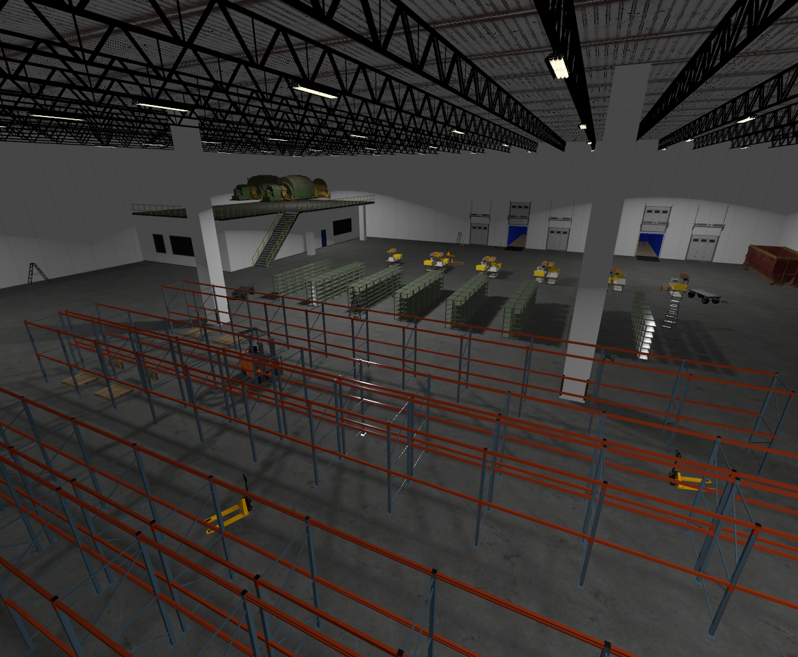

# jetty_demo
Jetty demo world and resources



Usage:

```bash
git clone https://github.com/gazebosim/jetty_demo
cd Jetty_Warehouse
gz sim -v 4 jetty.sdf
```

## Development on distrobox

```bash
distrobox create -n jetty_demo --hostname jetty_demo -i ghcr.io/gazebosim/jetty_demo:main
distrobox enter jetty_demo

git clone https://github.com/gazebosim/jetty_demo
cd jetty_demo/Jetty_Warehouse
gz sim -v 4 jetty.sdf
```

### Launching the Open-RMF demo

> [!NOTE]
> This section is actively being worked on. The instructions now only highlight running existing Open-RMF example demos.

```bash
# For ROS 2 Rolling development, don't forget to run rosdep
source /opt/ros/rolling/setup.bash

# We also recommend using rmw_zenoh_cpp since it comes installed on rolling
# TODO: start zenoh router from demo launch file eventually
export RMW_IMPLEMENTATION=rmw_zenoh_cpp
ros2 run rmw_zenoh_cpp rmw_zenohd

# For RMF development, we are using custom branches for packages for now that
# are affected by Qt migration
source /ws_rmf/install/setup.bash
ros2 launch rmf_demos_gz office.launch.xml
```

## Performance notes

It can take up to 1~2 minutes to load the world with all the models.
The GUI will be non-responsive during this time, see
https://github.com/gazebosim/jetty_demo/issues/3

To speed up loading the demo world, you can comment out different models
in the world, which helps improve startup time and RTF.

For example, some `Picking_Shelves*` were already commented out in
the world sdf file. To further speed things up, you can comment out
all of them.
